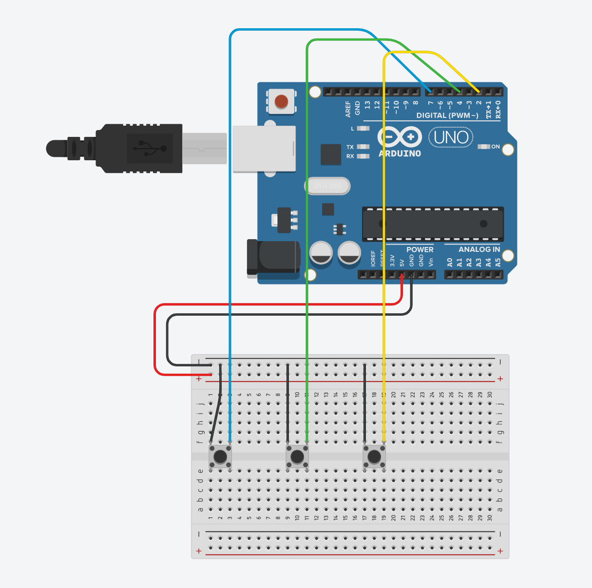

# Transport Exhibit

> This project was completed as part of ARTG 3250 Physical Computing, a class at Northeastern University.

An exhibit about balance and choices when it comes to transportation.

## Table of Contents

- [🪜 Setup](#-setup)
  - [🧱 Physical setup](#-physical-setup)
  - [🌐 Web setup](#-web-setup)
  - [🖥 Display setup](#-display-setup)
- [🏢 Repo structure](#-repo-structure)

## 🪜 Setup

### 🧱 Physical setup

To run this project, you'll need a few materials:

- 1 SparkFun RedBoard, with microUSB cable
- 1 breadboard
- 11 jumper wires
- 3 push buttons
- 1 potentiometer

The circuit diagram below shows how to hook up all of the materials:



You will also need a computer to run the web application, and [possibly a monitor](#display).

### 🌐 Web setup

1. If you haven't already, make sure the following items are installed and up-to-date:

   - [Homebrew](https://brew.sh/)
   - [Node.js](https://nodejs.org)
   - [NVM](https://github.com/nvm-sh/nvm)
   - [Yarn](https://classic.yarnpkg.com/lang/en/)

2. Clone this repository and install dependencies:

   ```sh
   nvm use
   yarn
   ```

3. Run the `develop` command to start the development server!

   ```sh
   yarn develop
   ```

### 🖥 Display setup

The app is designed to be displayed on a screen resolution of 1920px x 1080px. There are a few ways to accomplish this:

- Connect your computer to a monitor with a 1080p resolution. Open the web app in Chrome and full screen it so it takes up the entire size of the screen

- Connect your computer to a monitor with a resolution greater than 1080p, but with the same ratio of 16:9. Update the monitor settings to display a 1080p resolution, then follow the first option.

- Open the responsive screen mode in Chrome Dev Tools. In the inputs at the top, enter the resolution `1920 x 1080`. Update the scaling to fit within your Chrome window.

## 🏢 Repo structure

This repository takes the following structure:

```
|- board/
|  |- board.ino          # Arduino sketch
|
|- docs/
|  |- img/               # static images used in documentation
|
|- public/               # static files for the app
|  |- img/               # static images
|  |- index.html         # the root HTML file
|
|- src/                  # web app source code
|  |- components/        # resuable components
|  |- hooks/             # reusable hooks
|  |- providers/         # global or reusable context providers
|  |- App.tsx            # app root
|  |- index.tsx          # mount root (entry file)
|
|- .nvmrc                # NVM config file
|- package.json          # project config
|- tailwind.config.js    # Tailwind CSS config
|- tsconfig.json         # TypeScript config
|- tsconfig.paths.json   # TypeScript paths config (required for CRA)
|- README.md             # documentation (this file!)
```
